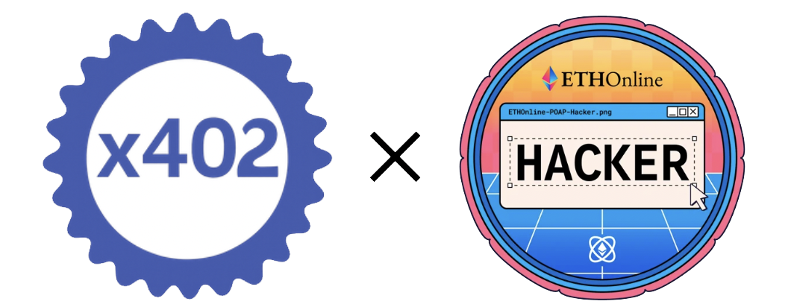

# x402 Rust Implementation

<div align="center">
  
</div>

<div align="center">

[](https://github.com/RyanKung/rust-x402/actions/workflows/ci.yml)
[](https://docs.rs/rust-x402)
[](LICENSE)
[](https://crates.io/crates/rust-x402)

</div>

A **high-performance, type-safe** Rust implementation of the x402 HTTP-native micropayment protocol.

> 🎉 **First public debut at [EthGlobal Online 2025](https://ethglobal.com)**

## 📦 Installation

Add this to your `Cargo.toml`:

```toml
[dependencies]
rust-x402 = "0.2.2"
```

## ✨ Features

- 🚀 **HTTP-native micropayments**: Leverage the HTTP 402 status code for payment requirements
- ⛓️ **Blockchain integration**: Support for EIP-3009 token transfers with real wallet integration
- 🌐 **Web framework support**: Middleware for Axum, Actix Web, and Warp
- 💰 **Facilitator integration**: Built-in support for payment verification and settlement
- 📦 **Standalone facilitator**: Production-ready facilitator server as standalone binary
- 🗄️ **Redis storage**: Optional Redis backend for distributed nonce storage
- 🔒 **Type safety**: Strongly typed Rust implementation with comprehensive error handling
- 🧪 **Comprehensive testing**: 114 tests with 100% pass rate covering all real implementations
- 🏗️ **Real implementations**: Production-ready wallet, blockchain, and facilitator clients
- 🌊 **Multipart & Streaming**: Full support for large file uploads and streaming responses
- 📡 **HTTP/3 Support**: Optional HTTP/3 (QUIC) support for modern high-performance networking

## 🚀 Quick Start

### Creating a Payment Server with Axum

```rust,no_run
use axum::{response::Json, routing::get};
use rust_x402::{
    axum::{create_payment_app, examples, AxumPaymentConfig},
    types::FacilitatorConfig,
};
use rust_decimal::Decimal;
use std::str::FromStr;

#[tokio::main]
async fn main() -> Result<(), Box<dyn std::error::Error>> {
    // Create facilitator config
    let facilitator_config = FacilitatorConfig::default();
    
    // Create payment configuration
    let payment_config = AxumPaymentConfig::new(
        Decimal::from_str("0.0001")?,
        "0x209693Bc6afc0C5328bA36FaF03C514EF312287C",
    )
    .with_description("Premium API access")
    .with_facilitator_config(facilitator_config)
    .with_testnet(true);

    // Create the application with payment middleware
    let app = create_payment_app(payment_config, |router| {
        router.route("/joke", get(examples::joke_handler))
    });

    // Start server
    let listener = tokio::net::TcpListener::bind("0.0.0.0:4021").await?;
    axum::serve(listener, app).await?;

    Ok(())
}
```

### 💳 Making Payments with a Client

```rust
use rust_x402::client::X402Client;

#[tokio::main]
async fn main() -> Result<(), Box<dyn std::error::Error>> {
    let client = X402Client::new()?;
    
    // Make a request to a protected resource
    let response = client.get("http://localhost:4021/joke").send().await?;
    
    if response.status() == 402 {
        println!("Payment required! Status: {}", response.status());
        // Handle payment required - parse PaymentRequirements and create signed payload
        // See examples/client.rs for complete implementation
    } else {
        let text = response.text().await?;
        println!("Response: {}", text);
    }
    
    Ok(())
}
```

### 🏭 Running the Standalone Facilitator Server

The facilitator can run as a standalone binary with optional Redis storage:

```bash
# In-memory storage (default)
cargo run --bin facilitator --features axum

# Redis storage backend
STORAGE_BACKEND=redis cargo run --bin facilitator --features axum,redis

# Custom configuration
BIND_ADDRESS=0.0.0.0:4020 \
REDIS_URL=redis://localhost:6379 \
REDIS_KEY_PREFIX=x402:nonce: \
cargo run --bin facilitator --features axum,redis
```

## 🏗️ Architecture

The Rust implementation is organized into several modules:

- 📦 **`types`**: Core data structures and type definitions
- 🌐 **`client`**: HTTP client with x402 payment support
- 💰 **`facilitator`**: Payment verification and settlement
- 🗄️ **`facilitator_storage`**: Nonce storage backends (in-memory and Redis)
- 🔧 **`middleware`**: Web framework middleware implementations
- 🔐 **`crypto`**: Cryptographic utilities for payment signing
- ❌ **`error`**: Comprehensive error handling
- 🏦 **`wallet`**: Real wallet integration with EIP-712 signing
- ⛓️ **`blockchain`**: Blockchain client for network interactions
- 🏭 **`blockchain_facilitator`**: Blockchain-based facilitator implementation
- 📡 **`http3`**: HTTP/3 (QUIC) support (feature-gated)
- 🔄 **`proxy`**: Reverse proxy with streaming support

## 🌐 Supported Web Frameworks

- 🚀 **Axum**: Modern, ergonomic web framework
- ⚡ **Actix Web**: High-performance actor-based framework
- 🪶 **Warp**: Lightweight, composable web server

## 🌐 HTTP Protocol Support

- ✅ **HTTP/1.1**: Full support with chunked transfer encoding
- ✅ **HTTP/2**: Full support with multiplexing
- ✅ **Multipart**: Support for `multipart/form-data` uploads (via `multipart` feature)
- ✅ **Streaming**: Chunked and streaming responses (via `streaming` feature)
- 🔜 **HTTP/3** (optional): QUIC-based HTTP/3 via `http3` feature flag

## 🎛️ Optional Features

x402 supports optional features for a modular build:

```toml
[dependencies]
rust-x402 = { version = "0.2.2", features = ["http3", "streaming", "multipart"] }
```

- **`http3`**: Enable HTTP/3 (QUIC) support
- **`streaming`**: Enable chunked and streaming responses
- **`multipart`**: Enable `multipart/form-data` upload support (requires `streaming`)
- **`redis`**: Enable Redis backend for facilitator storage
- **`axum`**: Enable Axum web framework integration (default)
- **`actix-web`**: Enable Actix Web framework integration
- **`warp`**: Enable Warp web framework integration

## ⛓️ Blockchain Support

Currently supports:
- 🏛️ **Base**: Base mainnet and testnet
- ❄️ **Avalanche**: Avalanche mainnet and Fuji testnet
- 📜 **EIP-3009**: Transfer with Authorization standard

## 📚 Examples

See the `examples/` directory for complete working examples:
- 🚀 `axum_server.rs`: Payment server using Axum
- 💳 `client.rs`: Client making payments
- 💰 `facilitator.rs`: Custom facilitator implementation
- 🏦 `real_implementation_demo.rs`: Real wallet and blockchain integration
- 🔐 `real_wallet_integration.rs`: Production-ready wallet integration

## 🏗️ Module Structure

This project follows a clean, modular architecture for better maintainability:

```
src/
├── facilitator/        # Payment verification & settlement
│   ├── mod.rs         # Main client implementation
│   ├── coinbase.rs    # Coinbase CDP integration
│   └── tests.rs       # Comprehensive test suite
│
├── crypto/            # Cryptographic utilities
│   ├── mod.rs         # Module exports
│   ├── jwt.rs         # JWT authentication
│   ├── eip712.rs      # EIP-712 typed data hashing
│   ├── signature.rs   # ECDSA signature verification
│   └── tests.rs       # Crypto test suite
│
├── types/             # Core protocol types
│   ├── mod.rs         # Type exports
│   ├── network.rs     # Network configurations
│   ├── payment.rs     # Payment types
│   ├── facilitator.rs # Facilitator types
│   ├── discovery.rs   # Discovery API types
│   └── constants.rs   # Protocol constants
│
├── middleware/        # Web framework middleware
│   ├── mod.rs         # Module exports
│   ├── config.rs      # Middleware configuration
│   ├── payment.rs     # Payment processing logic
│   ├── service.rs     # Tower service layer
│   └── tests.rs       # Middleware tests
│
└── ...                # Other modules
```

**Benefits**:
- 📖 **Clear Organization**: Each module has a single, well-defined responsibility
- 🔍 **Easy Navigation**: Find code quickly in focused, smaller files
- 📚 **Self-Documenting**: Rich module-level documentation in each `mod.rs`
- 🧪 **Better Testing**: Isolated test suites per module
- 🤝 **Team Friendly**: Reduces merge conflicts

All module documentation is embedded in the code - run `cargo doc --no-deps --open` to view!

## 📊 Testing

- ✅ **114 tests** with 100% pass rate
- 🧪 **Comprehensive coverage** of all real implementations
- 🔍 **Integration tests** for end-to-end workflows
- 🛡️ **Error handling tests** for robust error scenarios
- 🌊 **Multipart & streaming tests** for file upload/download scenarios
- 📡 **HTTP/3 tests** (with `http3` feature)
- 🗄️ **Redis storage tests** with auto-skip when unavailable
- ⚙️ **Feature-gated tests** for modular builds

## 📄 License

Licensed under the Apache License, Version 2.0. See LICENSE for details.
